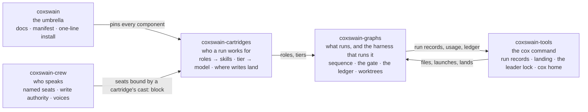

# Patrick Pfenning

**Data platform engineer** — seven years building cloud-native data and ML
platforms in Python, Spark, and Terraform, and lately the governance layer that
lets LLM agents do real engineering work without anyone having to trust them
blindly.

## Coxswain

*Agents pull the oars. You hold the tiller.*

[**Docs**](https://ppfenning.github.io/coxswain/latest/) ·
[**Install**](https://ppfenning.github.io/coxswain/latest/install/) ·
[**Releases**](https://ppfenning.github.io/coxswain/latest/releases/) ·
[**PyPI**](https://pypi.org/project/coxswain-tools/)

Coxswain builds software with a crew of AI agents and keeps a person on the
tiller. You describe a change; it is filed as a work item, sized (one ticket, or
an epic broken into phases and tasks), planned, built in its own worktree under
a dollar budget, linted and run against the project's own tests before a
reviewer spends a token, reviewed by two independent reviewers who are made to
disagree, arbitrated, validated against measured evidence rather than the
builder's word, and handed back as a pull request. A cartridge's *gate* says
how far the harness may go on its own; the default is `ticket`: it proposes, a
person merges. One session holds the leader lock and drives the landing loop;
every run leaves a record you can read, drill into, and get a notification
from.

```sh
uv tool install coxswain-tools     # or: brew install ppfenning/coxswain/cox
cox setup doctor
cox                                # the coxswain session: file, launch, land
```

**Status: beta, 0.2.0.** The loop runs daily on its own repositories, which is
also how its defects get found — and fixed, by the loop, as pull requests it
opens against itself.

### Five repositories, one thesis

Agents should earn autonomy the way engineers do — by track record, in writing,
revocably. Each repository is usable alone; together they read as one sentence.



[**coxswain**](https://github.com/ppfenning/coxswain) ·
[**coxswain-cartridges**](https://github.com/ppfenning/coxswain-cartridges) ·
[**coxswain-graphs**](https://github.com/ppfenning/coxswain-graphs) ·
[**coxswain-crew**](https://github.com/ppfenning/coxswain-crew) ·
[**coxswain-tools**](https://github.com/ppfenning/coxswain-tools)

- A **graph** owns sequence and writes nothing; one **harness** owns every
  consequence — the gate, the worktree, the checks, the append-only ledger. A
  new graph inherits all of it by existing rather than by remembering to.
- **Autonomy is earned per kind of write** against the ledger, scoped to one
  cartridge hash and one provider profile — and an auto-applied write records no
  ledger row, so nothing can ratchet up its own trust. Demotion comes from
  measured signals, never model opinion.
- **Every change arrives as a pull request**, rebased onto the target's default
  branch and held until the project's own checks pass. How far the harness may
  go on its own is a cartridge policy with four named levels, tighten-only
  through the chain, never a hard-coded behaviour.
- An **epic driver** takes an initiative from idea to a stack of pull requests —
  phases in dependency order, tasks fanned out in parallel worktrees, each under
  its own budget ceiling.
- **Two runners, one contract.** Nodes run against the Messages API, or as
  headless Claude Code sessions on a subscription with per-role tool grants, a
  disposable scratch tree for the builder, dollar ceilings per tier, and a
  turn-by-turn trace. Every run writes what each node cost.
- **A standing cast of named seats** — recon, triage, review, build, ops, the
  board, writing, the scribe — defined with no employer inside them, and bound
  to a team's skills by a cartridge. Voice is decoration: every seat works typed.
- **Deterministic work is a tool, not a turn.** Summing a run's cost, counting
  what a traced node did, cleaning up after a run, drawing the live table: each
  is a tested function a seat calls, so no tokens are spent producing the same
  answer twice.
