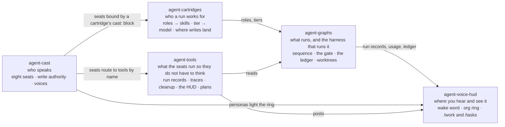

# Patrick Pfenning

**Data platform engineer** — seven years building cloud-native data and ML
platforms in Python, Spark, and Terraform, and lately the governance layer
that lets LLM agents do real engineering work without anyone having to trust
them blindly.

## The agent platform

Five repositories, one thesis: **agents should earn autonomy the way engineers
do — by track record, in writing, revocably.** Each is usable alone; together
they read as one sentence. Cartridges say who a run works for, graphs say what
runs, cast says who speaks, and the voice HUD is where you hear and see it.

[**agent-cartridges**](https://github.com/ppfenning/agent-cartridges) ·
[**agent-graphs**](https://github.com/ppfenning/agent-graphs) ·
[**agent-cast**](https://github.com/ppfenning/agent-cast) ·
[**agent-voice-hud**](https://github.com/ppfenning/agent-voice-hud) ·
[**agent-tools**](https://github.com/ppfenning/agent-tools) ·
[**the platform, drawn**](https://claude.ai/code/artifact/bbb368b7-c6cb-46d0-b0b7-f580fb5fc769)

- A **graph** owns sequence and writes nothing; one **harness** owns every
  consequence — the gate, the worktree, the checks, the append-only ledger. A
  new graph inherits all of it by existing rather than by remembering to.
- **Autonomy is earned per kind of write** against the ledger, scoped to one
  cartridge hash and one provider profile — and an auto-applied write records
  no ledger row, so nothing can ratchet up its own trust. Demotion comes from
  measured signals, never model opinion.
- A **swarm driver** takes an initiative from idea to a stack of draft PRs —
  phases in dependency order, tasks fanned out in parallel worktrees — with
  **no code path that merges to main**. The irreversible act is priced by
  target, not by operation.
- **Two runners, one contract.** Nodes run against the Messages API, or as
  headless Claude Code sessions on a subscription with per-role tool grants,
  a disposable scratch tree for the builder, dollar ceilings per tier, and a
  turn-by-turn trace. Every run writes what each node cost.
- **A standing cast of eight seats** — recon, triage, review, build, ops,
  the board, writing, the scribe — defined with no employer inside them, and
  bound to a team's skills by a cartridge. The chief of staff is the session
  you are talking to. Voice is decoration: every seat works typed.
- **Deterministic work is a tool, not a turn.** Summing a run's cost, counting
  what a traced node did, cleaning up after a run, posting to the HUD: each is a
  tested function a seat calls, so no tokens are spent producing the same answer
  twice.
- **Portability is enforced by tests**, not by intention: the graphs fail on
  any employer-shaped constant, and the cast's CI fails on any vendor named.
  The whole suite runs offline against a scripted runner.

## Before that

Three years at BlastPoint (2023–2026) owning a customer-intelligence data
platform end to end. The centerpiece was the ingestion and load path: delta
ingestion from client feeds we didn't control, fanned out across 40+ AWS
accounts into a bronze/silver/gold lakehouse built in PySpark and Arrow, with
data-quality gates that fail a run rather than pass bad data downstream. Led
the pandas→Spark migration and trained the team through it; owned the
Terraform behind the fleet; led incident response when production broke.
Mentored engineers through code review, pairing, and incident coaching —
several earned promotions on the way. Put LLM agents into the on-call loop
for first-pass triage and PR review because the alert volume justified it.

**Stack:** Python · SQL · PySpark · PyArrow · AWS (S3, Batch, Step
Functions, Athena) · Terraform (multi-account via AFT) · Airflow ·
Docker · PostgreSQL · Snowflake · GitHub Actions

## Elsewhere

- [Chaotic Neural Networks for Asymmetric Encryption of Audio Files](https://github.com/ppfenning/Chaotic-Neural-Networks-for-Asymmetric-Encryption-of-Audio-Files) — graduate research, MS Data Science
- BS Applied Mathematics ('17) · MS Data Science ('23) — Wentworth Institute of Technology

Off the clock: the Vermont outdoors, a Proxmox homelab, and a Neovim config
tuned well past the point of diminishing returns.

[LinkedIn](https://www.linkedin.com/in/patrick-pfenning) · [pfenningpat@gmail.com](mailto:pfenningpat@gmail.com)
